<a name="readme-top"></a>

<!-- TABLE OF CONTENTS -->

<summary><b>Table of Contents</b></summary>
<ol>
  <li><a href="#about-the-project">About The Project</a></li>
  <li><a href="#business-objective">Business Objective</a></li>
  <li><a href="#business-metrics">Business Metrics</a></li>
  <li><a href="#dataset">Dataset</a></li>
  <li><a href="#method">Methods</a></li>
  <li>
    <a href="#exploratory-data-analysis">Exploratory Data Analysis</a>
    <ul>
      <li><a href="#ratings">Ratings</a></li>
      <li><a href="#price-rates">Price Rates</a></li>
      <li><a href="#release-date-range">Release Data Range</a></li>
    </ul>
  </li>
  <li><a href="#preprocessing-and-featuring-data">Preprocessing and Featuring Data</a></li>
  <li>
    <a href="#1-content-based-recommendation-system">Content-Based Recommendation System</a>
    <ul>
      <li><a href="#text-preprocessing-tokenization">Tokenization</a></li>
      <li><a href="#text-preprocessing-stemming">Stemming</a></li>
      <li><a href="#text-preprocessing-term-frequency-tf-and-inverse-document-frequency-idf-vectorizer">TF-IDF</a></li>
      <li><a href="#cosine-similarity">Cosine Similarity</a></li>
      <li><a href="#content-similar-recommendation">Similarity Recommendation</a></li>
      <li><a href="#novelty">Novelty</a></li>
      <li><a href="#serependity">Serependity</a></li>
    </ul>
  </li>
  <li>
    <a href="#2-neighborhood-collaborative-filtering">Neighborhood Collaborative Filtering</a>
    <ul>
      <li><a href="#utility-matrix">Utility Matrix</a></li>
      <li><a href="#item-to-item-neighbor-cf">Item-to-Item Neighborhood Collaborative Filtering</a></li>
      <li><a href="#user-to-user-neighbor-cf">User-to-User Neighborhood Collaborative Filtering</a></li>
      <li><a href="#recommendation-system-evaluation-rmse">Recommendation System Model Evaluation</a></li>
    </ul>
  </li>
  <li>
    <a href="#3-context-aware-factorization-machines">Context-Aware Factorization Machines</a>
    <ul>
      <li><a href="#factorization-machines">Factorization Machines</a></li>
      <li><a href='#fm-regression-optimization-tasks'>FM Regression Optimization</a></li>
      <li><a href="#fm-regression-model">FM Regression Models</a></li>
      <li><a href="#fm-regression-optimization-tasks">FM Classification Optimization</a></li>
      <li><a href="#fm-classification-models">FM Classification Models</a></li>
      <li><a href="#fm-classification-models-performance">FM Classification Model Performance</a></li>
    </ul>
  </li>
  <li>
    <a href="#alternating-least-square">Alternating Least Square</a>
    <ul>
      <li><a href="#als-models">Alternating Least Square Model</a></li>
    </ul> 
  </li>
  <li><a href="#conclusion">Conclusion</a></li>
  <li><a href="#references">References</a></li>
</ol>

<!-- About the Project -->
# About the Project

Steam is currently the largest digital distribution service for PC gaming, operated by Valve Corporation. According to the annual statistics report for 2022, Steam reached a peak online user count of 33 million, with an impressive 44.7 billion gigabytes of game downloads over the year. One of the key reasons for Steam's rapid growth is its strong searchability in the store, which was highlighted in the report. They are actively working on a new recommendation system driven by machine learning to help users find games that match their personal preferences. While the algorithm is just one part of the searchability solution, they are also developing more interactive and user-friendly features, continually evaluating the overall store design.

On the flip side, the recommender system in marketplace is commonly also affected by the *Matthew Effect*, which means that games developed by large game companies receive more advertising budgets and, consequently, become very popular. Popular games often appear at the top of store web pages and attract more users, including you and your friends, to make purchases. In contrast, games developed by small studios or individual developers may not have the same advertising luck. Some mid-budget users are more inclined to wait for their preferred games to be launched a few months later or simply wait for discounts on their preferred games. This can lead these typical users to become inactive or even churn, even though there may be hidden gems that match their preferences based on user activity logs or given ratings for various games.

<p align="right">(<a href="#readme-top">back to top</a>)</p>

# Business Objective

Our goal is to develop a recommendation system approach for product suggestions, with a focus on middle-tier users who make purchasing decisions based on their given ratings or preferences (as indicated by their activity logs). We aim to identify hidden gems, which could be either budget-friendly on medium price range options or lesser-known games from smaller developers, rather than those produced by major game developers.

- First method is **Content-based recommendation system**, is to generate more similar games but, focusing in **novelty** (how unknown user to related item) and **serependity** (how related the item to user) to help users discover new gaming experiences.

- Second, is **Collaborative Filtering** with **Context-Aware Factorization Machine** for price rate and release date of games to give recommendation based on rating given (*Regression*) and do user recommend it or not (*Classification*).

- Third, is **Collaborative Filtering** with **Bayesian Pesonalized Ranking** and **Alternating Least Square** to utilize the implicit data (hours play) by user.

<p align="right">(<a href="#readme-top">back to top</a>)</p>

# Business Metrics

We evaluate the accuracy of our results by separating the dataset into a test set and a training set. Specifically, we attempt to predict the values in the test set using the training set fitted. 

The evaluation metrics that will be used in this recommendation system approach is **RMSE** for *Rating-based prediction*, **F1-Score** for *Class classfication prediction* and **nDCG** for *Ranking recommendation*.

# Dataset

The datasets is retrieved from Kaggle Dataset of [**Steam's user log**](https://www.kaggle.com/datasets/antonkozyriev/game-recommendations-on-steam) and [**Steam's game description**](https://www.kaggle.com/datasets/trolukovich/steam-games-complete-dataset) which are updated until 2022-12-31. **Steam's User log** is consist total **[37.800.000, 23]** and **steam games description** is consist total of **[40.000, 20]**. However for 37.8 Mio in total instance will greatly cost computational time in training the recommendation system, hence we reduce to used only **1000_000** total instances. Dataset is splitted using `train_test_split` library from `sklearn.model_selection` package to produce equal distributed features from the original data.

<style>
    table {
        font-size: 10px; /* You can adjust the font size as needed */
        width: 80%; /* Adjust the table width as needed */
    }
</style>

| Column Name        | Describe                            | dtype    |
| :----------------- | :---------------------------------- | :------- |
| *user_id*          | User unique identifier              | object   |
| *app_id*           | Steam's game unique identifier      | object   |
| *date*             | Steam's game release date           | datetime |
| *is_recommended*   | User vote up the game if True       | bool     |
| *hours*            | Hour of user spent on game          | float64  |
| *title*            | Steam games name                    | object   |
| *rating*           | Rating given by user on played game | object   |
| *price_final*      | price after discounted              | float64  |
| *developer*        | Steam's game developer              | object   |
| *publisher*        | Steam's game publisher              | object   |
| *Categories*       | Steam's game category               | object   |
| *genre*            | Steam's game genre                  | object   |
| *popular_tags*     | Steam's game popular tags           | object   |
| *game_description* | Steam's game description            | object   |
|                    |                                     |          |

<p align=left>
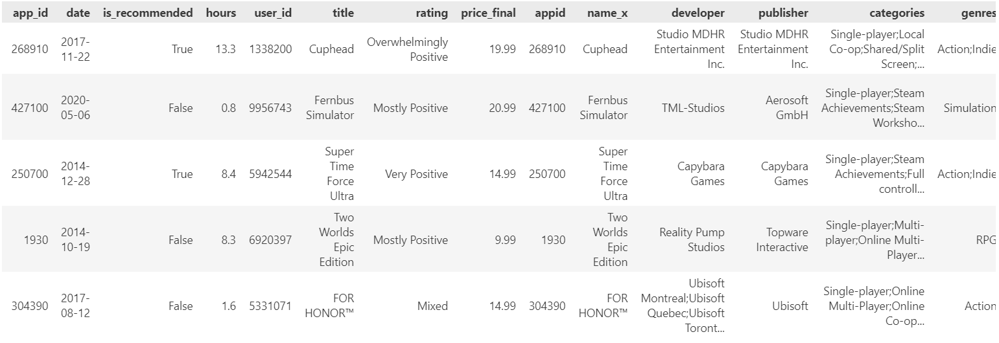
</p>

# Methods 

There are several datasets setting that we are used in this project to observed several Recommendation System model performance.

1. *Table 1: User IDs, App IDs, title, categories, genre, popular tags, and game_description*. <br>
This table is used to utilize the **content-based recommendation system** by ignoring user preference, and just calculate similarity between games based on game's title, genre, tags and description (App IDs). Dimension of data used is 1000_000 x 7, and will be increase by being added Interaction counts, Novelty scores, Serependity scores features to calculate those feature effect to recommendation.

2. *Table 2: User IDs, App IDs, Rating*.<br>
This table is only contains user_id, app_id and rating given by user to certain games. The ratings given will be classified into certain ordinal class, and utility matrix is given by these features. Dimension of data used is highly reduced to 20_000 x 3, since it will harm computational cost we will split using [`train_test_split`](https://scikit-learn.org/stable/modules/generated/sklearn.model_selection.train_test_split.html) from `sklearn.model_selection` libraries. **Neighborhood Collaborative Filtering** is applied to this dataset.

3. *Table 3: User IDs, App IDs, Rating, price_final, release date*.<br>
This table contains price_final and release date to utilize context-aware recommendation later on this project, to utilize user preference based on its price or released date. Dimension data instances used is same with *Table 2* with 2 more features. The prediction model use **Context-Aware Regression Factorization Machines** to predict rating given by user based on game's price and release date context.

4. *Table 4: User IDs, App IDs, is_recommended, price_final*.<br>
This table is same with *Table 3* but the difference is rather than use continous data like rating, we are using binary data like is_recommended to predict whether user-u will recommend the item-i or not. The prediction model use **Context-Aware Classification Factorization Machines** to predict whether user recommend this games or not based on game's price and release date context.

5. *Table 5: User IDs, App IDs, hours*.<br>
This table is same with *Table 3* but rather than use explicit data like ratings, we are use implicit data like hours play of user-u on item-i. The prediction model use **Bayesian Personalized Ranking Model** from [`implicit`](https://pypi.org/project/implicit/) libraries to predict whether user will be played this games or not.

<p align="right">(<a href="#readme-top">back to top</a>)</p>

# Exploratory Data Analysis

### Ratings

Rating feature on steam dataset will be our target on several recommendation system model as explicit data. Next, these categorical rating will be converted into numerical rating scale by 1-9 as ordered from the lowest to highest below.

<p align=center>
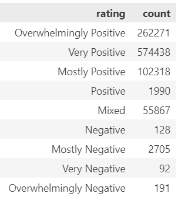
</p>

<p align=center>
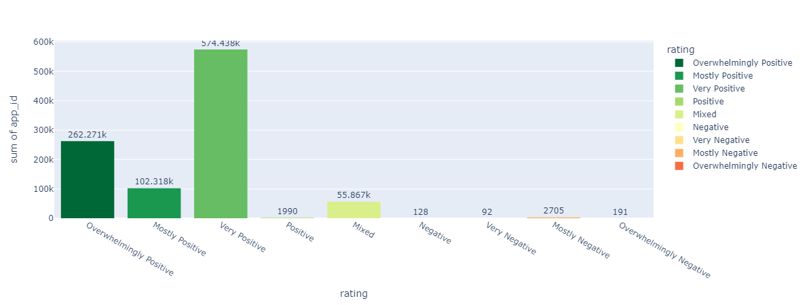
</p>

The majority of ratings fall into the positive category, with "Very Positive" and "Overwhelmingly Positive" being the two highest-rated categories by a significant margin. "Very Positive" is given 574,438 times by users to several games they interact with as the biggest number of rating given in steam dataset, followed by "Overwhelmingly Positive" is given by 262,271 times. This suggests that games in steam has received a largely positive response from users. 

While positive ratings dominate, there is still a substantial number of users who have given a "Mixed" rating. This indicates that there is some variability in how users perceive or experience the games, with both positive and negative feedback. 

The "Very Negative" rating has the fewest counts that given 92 times by users in steam for few games, however negative rating given by user is more likely low for several games like "Overwhelmingly Positive" is given 191 times and "Negative" only given by 128 times. This is a relatively positive sign, as it suggests that the games in steam is not widely disliked. 

### Price Rates

<p align=center>
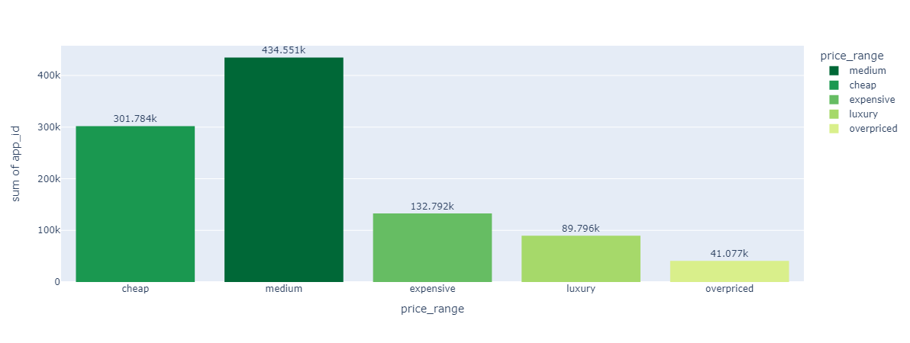
</p>

Since we are intended to use price as context to define what rating will user given to certain item based on its price range. These price range is subjective and in this projcet are separated into 5 categories. 

- $0 - $7.5 (Free - IDR 120,000) as **cheap** games. <br>
Free games is not casually considered high for certain user and most likely offer buy-in-game (skins, characters) such as Fornite, Valorant, Genshin Impacts. under $7.5 (IDR 120.000) games are considered the best affordable games, with many good titles often reduced in price through discounts. Most users opt for games in this price range either because they are budget-friendly or while waiting for the release of larger games.

- $7.5 - $22.5 (IDR 120,000 - IDR 350,000) as **medium** games. <br>
Games in this range are considered a good value, and occasionally, even big-name games are discounted to this price range. It's also common to find popular games released within the last three years in this category.

- $23 - $33 (IDR 350,000 - IDR 500,000) as **expensive** games. <br>
Newer games tend to fall within this price range, and the highest-priced games may occasionally drop into this category after discounts.

- $33 - $53 (IDR 500,000 - IDR 800,000) as **luxury** games. <br>
Trending or the latest AAA games are more likely to be priced in this range, although users should not hesitate to invest in luxury trending games if they desire the experience.

- $53 - ~ (IDR 800,000) as **overpriced** games.<br>
Games in this price range are the most expensive on Steam, and only a few users can afford them.

### Release date range

<p align=center>
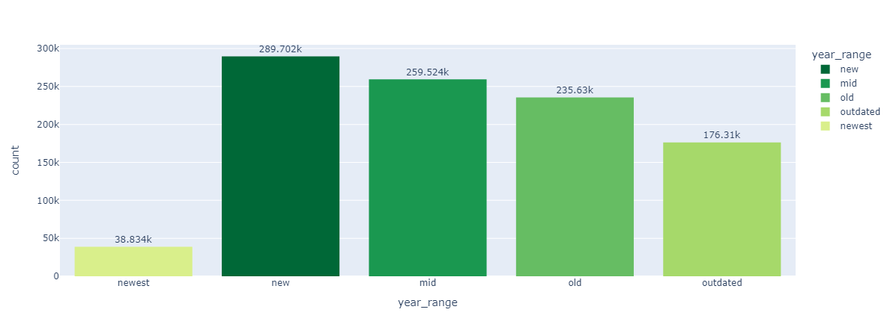
</p>

Release date is also will be considered to use in defined predicted rating that user would give. Some user is more likely not prefer over 10 years released date games and consider more into new stuff. Release date range are separated into 5 ranges:

- 0 - 1 years as **newest**.<br>
Some games in this range may have high prices and relatively lower user interactions, but games with lower prices and higher user ratings are considered as good stuff (hidden games).

- 1 - 3 years as **new**.<br>
Many users eagerly await games in this range, and some of them start to receive discounts. Games within this timeframe generally have a higher user interaction count compared to newer releases.

- 3 - 5 years as **mid**.<br>
Big AAA games often become more affordable after being in this range for a while.

- 5 - 10 years as **old**.<br>
Some users still have an interest in playing games from this range, and their prices are significantly reduced, making them the most affordable option.

- over 10 years as **outdated**.<br>
Users typically have lower preferences for games that have been around for more than a decade.

# Preprocessing and Featuring Data

<p align = center>

</p>

# 1. Content-Based Recommendation System

### Text Preprocessing: Tokenization

<p align = center>

</p>

Tokenization is the process of converting sensitive data into non-sensitive data called tokens.

Input: “Keep your eyes on this one, because it’s one quality Action RPG”

Output: [‘Keep’, ‘your’, ‘eyes’, ‘on’, ‘this’, ‘one’, ‘because’, ‘its’, ‘one’, ‘quality’, ‘action’, ‘rpg’]

In this example, the input text is tokenized into a list of individual words or tokens. The punctuation marks are removed during the tokenization proces.

In data preprocessing, tokenization is assigned to features names `tags` that combined from game title, game genre, game popular tags, and game description. However we ignore the game publisher and game developer since we do not want to get recommendation from similar developer or publisher.

```python
# tokenize the tags information and lowerize the character
new_data_content['tags'] = new_data_content['tags'].str.replace(',',' ')
new_data_content['tags'] = new_data_content['tags'].apply(lambda x: x.lower() if isinstance(x, str) else np.nan)
```
<p align="right">(<a href="#readme-top">back to top</a>)</p>

### Text Preprocessing: Stemming

<p align=center>

</p>

Stemming is the process of reducing derived words to their base word form.<br>

For example, a stemmer for English operating on the stem “cat” should identify such strings as “cats”, “catlike”, and "catty". <br>
A stemming algorithm might also reduce the words “fishing”, “fished”, and “fisher” to the stem "fish".

`SnowballStemmer` from `nltk.stem` package is used in this process

```python
from nltk.stem import SnowballStemmer

ss = SnowballStemmer(language='english')

#defining the stemming function
def stem(text):
    y=[]
    
    for i in text.split():
        y.append(ss.stem(i))
    
    return " ".join(y)
```
<p align="right">(<a href="#readme-top">back to top</a>)</p>

### Text Preprocessing: Term-Frequency (TF) and Inverse Document Frequency (IDF) Vectorizer

**Term-Frequency** is giving each word weight/value based on their occurence, rather than perform One Hot Encoder to split a word into a new feature.

$$ TF(word,document) = \frac{Number \ of \ word \ appear \ in \ a \ document}{Total \ word \ in \ a \ document} $$

However some frequent word can put into a sentence, hence term-frequency becoming bigger compared to other, and need to adjust to get better added value. **Inverse Document Frequency** can penalized the TF Score, means that if a term appears in many documents, its IDF value will decrease.

$$ IDF(word, document) = \log({\frac{Total \ Number \ of \ Document \ in \ corpus}{Number \ of \ Documents \ with \ word}}) $$

```python
from sklearn.feature_extraction.text import TfidfVectorizer

vectorizer = TfidfVectorizer()

count_matrix = vectorizer.fit_transform(new_data_content['tags'])
```
<p align="right">(<a href="#readme-top">back to top</a>)</p>

### Cosine Similarity

Cosine similarity measure the direction between the two items or word. The cosine similarity between two vectors is measured in ‘θ’.

- If θ = 0°, the ‘x’ and ‘y’ vectors overlap, thus proving they are similar.<br>
- If θ = 90°, the ‘x’ and ‘y’ vectors are dissimilar.

$$ \cos{\theta{}} = \frac{A.B}{\lVert A \rVert  \ \lVert B \rVert} $$

<p align=center>
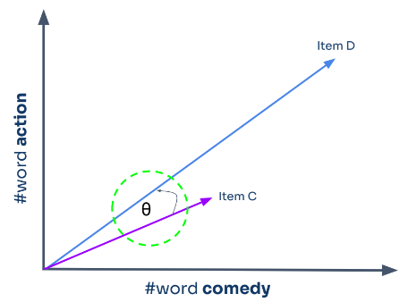
</p>

```python
from sklearn.metrics.pairwise import cosine_similarity

# Calculate cosine similarity toward tags feature after stemmed
cosine_sim = cosine_similarity(count_matrix, count_matrix)
```
<p align="right">(<a href="#readme-top">back to top</a>)</p>

### Content Similar Recommendation

Product-suggestion is performed based on the similar app_id or steam games, that will return n-games that similar of played or bought item by user log.

```python
def item_recommendations(id, cosine_sim=cosine_sim):
    indices = pd.Series(new_data_content.index, index = new_data_content['app_id']).drop_duplicates() 
    idx = indices[id]

    sim_scores = list(enumerate(cosine_sim[idx]))
    sim_scores = sorted(sim_scores, key=lambda x: x[1], reverse=True)

    # Extract the app_ids from sim_scores[1:11]
    app_ids_to_select = [sim[0] for sim in sim_scores[1:11]]

    recommendation = new_data_content.loc[new_data_content.app_id.isin(app_ids_to_select)]

    return recommendation
```
<p align=left>
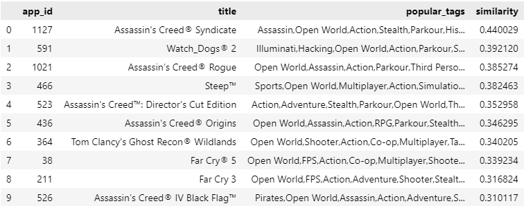
</p>
<p align="right">(<a href="#readme-top">back to top</a>)</p>

The games we searched for similarity is Assassin's Creed Odyssey, and its found out the content-based recommendation for using similarity function only return most similar title games like another Assassin's Creed game fanchise above being the highest similarity. However, this recommendation system could be better for user who prefer franchise games.

### Novelty

Novelty measure how unknown the items by all user in our dataset.

$$ Novelty(item_{i}) = \frac{count(user \ who \ has \ not \ interacted \ with \ item \ i)}{count(all \ user)}  $$

- Novelty ~= 0, items is well known by all users
- Novelty ~= 1, items is unknown by all users

```python
def calculate_novelty_based_on_rarity(app_data):
    # Assuming 'interaction_count' is a column in your dataset representing how often the app has been interacted with.
    
    app_data['novelty_score'] = (app_data.user_id.nunique() - app_data['interactions_count']) / app_data.user_id.nunique()
    
    return app_data
```

#### Novelty and Similar Recommendation

<p align=left>
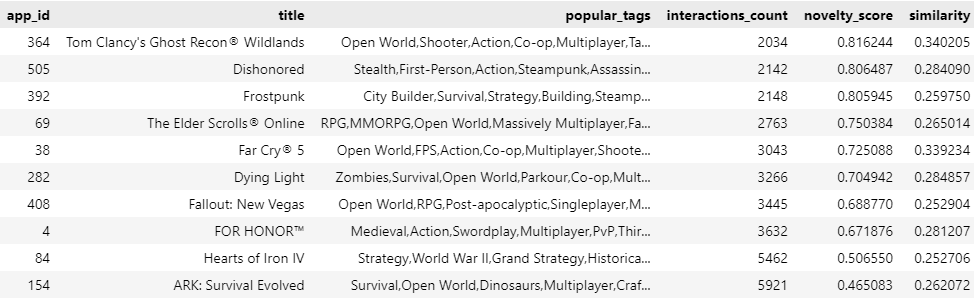
</p>

A recommendation system that takes into account the novelty score indeed yields better results compared to the previous recommendation methods. It considers similarities in game genres and tags, such as 'Open-world' and 'RPG,' when suggesting games like Assassin's Creed Odyssey. This approach results in recommendations like Ghost Recon Wildlands, Dishonored, and Far Cry 5. However, there are instances where the recommended games, like FrostPunk, may not be very similar in terms of genre but share some relevant tags with our target game. This issue can be addressed by incorporating additional related genres or tags while also filtering out unrelated tags during the tokenization process.

The novelty score can generate high scores, primarily due to the large number of unique users, which in this case totals 10,266. However, it's important to note that novelty can introduce **bias**, especially for more **recently released games**, as they tend to have **lower interaction counts**. For instance, games like Far Cry 5 and Watch Dogs 2 may receive lower interaction counts simply because they are newer releases.

<p align="right">(<a href="#readme-top">back to top</a>)</p>

### Serependity

Serependity refers to ability to provide recommendation that are both surprising and useful. These are not only novel and diverse like previous, but also relevant to the user's interest. It's challenging to create a precise function for serendipity because it depends on various factors and is highly subjective. However, you can create a simple Python function to calculate a basic serendipity score based on some criteria.

Serependity is simply combination of **Relevance** of items and **Unexpectedness** of item.

$$ Serependity(item_{i} = Relevance(item_{i}) * Unexpectedness(item_{i})) $$

Unexpectedness refer to the recommendation is not similar item to past recommendation

$$ Unexpectedness(i) = \frac{\sum_{hEH} (1-Similarity(i,h))}{Number \ of \ H} $$

while i = item in user recommendation<br>
&emsp;&emsp; H = Historical item interaction list(such as rating activity, click, etc)

#### Serependity and Similar Recommendation

<p align=left>
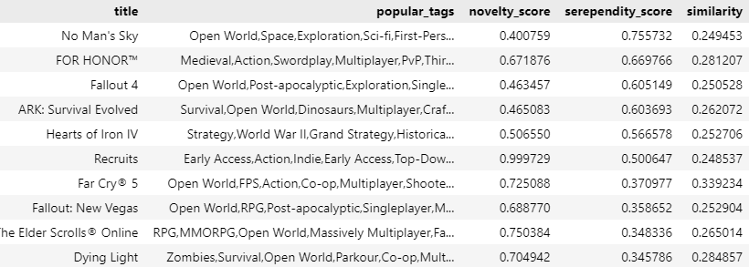
</p>

A recommendation system based on the serendipity score tends to provide more randomized game suggestions that, while not precisely similar to our searched game (Assassin's Creed: Odyssey), still appear relevant. For example, it might suggest games like No Man's Sky, Fallout 4, Far Cry 5, and ARK: Survival World, which are categorized as action, RPG, and open-world games. While these recommendations may not align perfectly with the searched game, they can be appealing to users who have a preference for games similar to Assassin's Creed: Odyssey.

The serendipity score is designed to introduce an element of surprise and novelty into the recommendations, which can help users discover new gaming experiences. It takes into account various factors that may not be directly tied to the primary characteristics of the searched game but still share some thematic or gameplay elements. In this case, the recommendations include titles that offer elements of action, RPG elements, and an open-world experience.

The benefit of this approach is that it can prevent the recommendation system from becoming too predictable and may lead users to discover unexpected yet enjoyable games. However, it's important to strike a balance, as excessive randomness may result in less relevant suggestions. Finding the right mix of serendipity and relevance is key to creating an engaging and effective recommendation system.

**Note**: I was the one who play these stuff games so I subjectively enough can say last two recommendation system indeed suggests good recommendations.

<p align="right">(<a href="#readme-top">back to top</a>)</p>

# 2. Neighborhood Collaborative Filtering

<p align = center>

</p>

Content-based recommendation systems have demonstrated effectiveness in providing game suggestions based on inherent content characteristics. However, it is important to recognize that individual users often have unique preferences for specific games. Collaborative Filtering techniques leverage these individual preferences to enhance recommendation quality by identifying similarities among users or items.

In particular, Neighborhood Collaborative Filtering focuses on user preferences by considering the behavior of similar users, thus refining the recommendations. We started by employed the K-Nearest Neighbors Baseline (KNNBaseline) algorithm from the Surprise library, which can be applied to both user-to-user and item-to-item Collaborative Filtering, to predict user ratings for specific items. To further enhance our recommendation system, another approaches of Context-Aware Factorization Machines is applied to involve the incorporation of contextual information, such as game pricing and release dates, into the Collaborative Filtering framework. This approach aims to provide users with more tailored and context-aware recommendations, ultimately improving the overall user experience.

## Utility Matrix

In recommendation system, there are interaction between two entities of users and items, users have preference for certain items, and these preference must be teased out of the data. These interaction of user-item pair is representated as a *utility matrix* which a value represents what is known about the degree of preference of user-u for item-i. This matrix is commonly sparse, because the most entries are NaN or Unknown. an Unknown value implies we have no explicit information about certain user-u preference for the item-i.

<p align=center>

</p>

Utility matrix above represents information of explicit data such as given rating from an user to an item. Since utility matrix is sparse, there should be more 'NaN' or '0' values. Notice that most user-item pairs have 0 value, meaning the user has not rated the movie. The goal of most recommendation system is to predict the 'NaN' values in utility matrix.
<p align="right">(<a href="#readme-top">back to top</a>)</p>

## Item-to-Item Neighbor CF
---------

<p align=center>
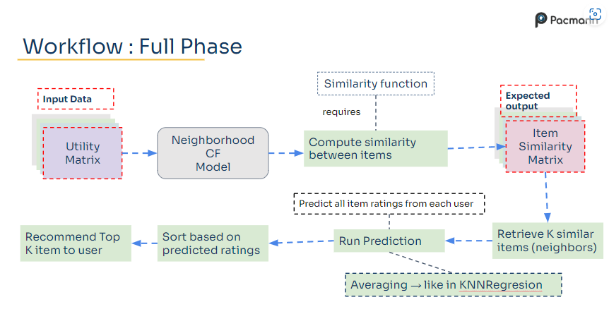
</p>

The goal is recommend games that user might like, so we predict rating the user given for certain games, the highest rating the user given indicates the user is prefer the game.

Neighborhood Collaborative Filtering Approach work by finding similarities either in users or items and calculate predicted rating averaging rating from its neighbor. Predicted rating function is derived below with baseline function to handle such of user and item bias since user has varying rating scale, some gave higher rating others gave lower to an item while some items also are in average rated higher than others.

Lets given a two user of user-u and user-j with two item-i and item-h, for item-to-item CF, we will defined similarity between item-i and item-h.

$$\hat{r}_{ui} = baseline_{u,i} + \frac{\sum_{j∈N(u)}(Similarity(i,h). \ (r_{ji} - baseline_{u,h}))}{\sum_{j∈N(u)} Similarity(i,h)}$$

$\hat{r}_{ui}$ = Predicted ratings from user u on item i<br>
$r_{ji}$ = ratings from user j on item i<br>
$\sum_{j∈N(u)}$ = sum through all neighbors from user u<br>

$baseline_{u,i}$ = $\mu_{global} + b_{user u} + b_{item i}$

The input data is utility matrix that defined user-item interaction, could be rating given by user-u to item-i. Next computed using Neighborhood CF model, in this case is using `KNNBaseline` function from `surprise` library with number of *k : 15* and using *pearson correlation* similarity function.

```python
rating_data.pivot(index='user_id', columns='app_id', values='rating')
```

```python
from surprise import KNNBaseline

#create dictionary of parameter
params_item_item = {'k':list(np.arange(start=5, stop=40, step=5)),
          'sim_options':{'name':['cosine','pearson_baseline'],'user_based':[False]}}

# Tuning item-to-item collaborative filtering
tuning_item = RandomizedSearchCV(algo_class=KNNBaseline, param_distributions = params_item_item,
                   cv=5
                   )
```
<p align="right">(<a href="#readme-top">back to top</a>)</p>

## User-to-User Neighbor CF
--------

<p align=center>
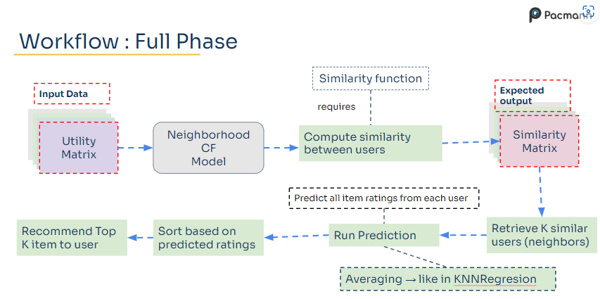
</p>

In user-to-user CF, we will predict rating that will given by user to certain item based on similarity between the users. For simple example is, if user-1 is watched film A and B while user-2 is also watched film A and B but user-2 have watched film C, then film C will be recommend to user-1 since both have watched same film.

The prediction function for user-to-user is similar with the function for item-to-item CF but rather than compute similarity between item-i and item-h we will compute similarity between user-u and user-j

$$\hat{r}_{ui} = baseline_{u,i} + \frac{\sum_{j∈N(u)}(Similarity(u,j). \ (r_{ji} - baseline_{j,i}))}{\sum_{j∈N(u)} Similarity(u,j)}$$

$\hat{r}_{ui}$ = Predicted ratings from user u on item i<br>
$r_{ji}$ = ratings from user j on item i<br>
$\sum_{j∈N(u)}$ = sum through all neighbors from user u<br>

$baseline_{u,i}$ = $\mu_{global} + b_{user u} + b_{item i}$

For user-to-user, number of *k* is 5 and using *cosine similarity* function to compute similarity between users.

```python
from surprise import KNNBaseline

#create dictionary of parameter
params_user_user = {'k':list(np.arange(start=5, stop=40, step=5)),
          'sim_options':{'name':['cosine','pearson_baseline'],'user_based':[True]}}

# Tuning user-to-user collaborative filtering
tuning_user = RandomizedSearchCV(algo_class=KNNBaseline, param_distributions= params_user_user,
                                 cv=5
                                 )
```
<p align="right">(<a href="#readme-top">back to top</a>)</p>

#### Recommendation System Evaluation: RMSE

<p align=center>
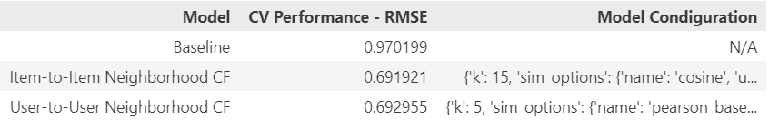
</p>

The **User-to-User Neighborhood Collaborative Filtering** model has been identified as the better model for predicting ratings in this case, with an **RMSE (Root Mean Square Error)** of **0.691921**, closely followed by the Item-to-Item CF model with an **RMSE of 0.692955**. However, it's important to note that these models calculate predicted ratings without taking context-aware factors into account. Consequently, they may tend to recommend items that are most similar to a user's past preferences, such as games with similar titles or from the same developer, while ignoring considerations like release date range or price range.

This approach could potentially lead to users being reluctant to purchase games they already own in a particular franchise (e.g., Assassin's Creed Franchise, Far Cry Franchise) or games that are priced beyond their budget. However, it's worth acknowledging that some users have a strong inclination to replay games from the same franchise repeatedly, and it can be beneficial to showcase such games as part of the recommendations. This approach can increase the likelihood of users making a purchase, aligning with their preferences, and enhancing their overall gaming experience.

<p align="right">(<a href="#readme-top">back to top</a>)</p>

# 3. Context-Aware Factorization Machines
--------

### Factorization Machines

Previously, we learn that rating prediction is generated by user, item and bias interaction. However, some user prefer to watched certain types of film or played certain genre of games. user-u is playing games item-i which is RPG and Action-shooter, hence next recommendation should be games with RPG and Action-Shooter genres. This concept is similar to applying filter in marketplace search enginee, while user want to search certain games, they will start by filter it for its genre, year release date, or anything that related to that games.

Added context such as genre, will add more dimensionality to our utility matrix for each context. So we can reshape it to become like common machine learning task data, where it have pair of <X,y> where X is predictor and y is target.

<p align=center>
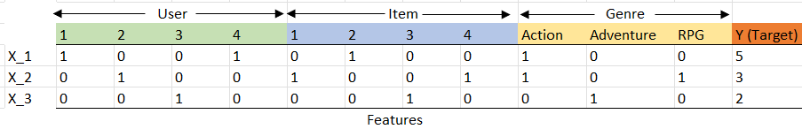
</p>

Since we have more feature of users, items, and genres, we can apply regression function to predict rating (y):

$$ f(x) = w_{user}.user + w_{item}.item + w_{genre}.genre $$

However, we may needed to consider user and item interaction as factorization machine approachs. The model equation for a factorization
machine of degree d = 2 is defined as (Rendle, 2010):

$$ f(x) = w_{0} +   \sum_{n=i} w_{i}.x_{i} + \sum_{n=i}\sum_{j=i+1} w_{i,j}.x_{i}.x_{j} $$

$$ f(x) = w_{0} +   \sum_{n=i} w_{i}.x_{i} + \sum_{n=i}\sum_{j=i+1} <v_{i},v_{j}>x_{i}.x_{j} $$

$w_{0}$ = intercept <br>
$w_{i}$ = feature weight or 'coefficient'<br>
$w_{i,j}$ = interaction weight or 'interaction'<br>
$v_{i},v_{j}$ = latent factor value<br>
$x_{i},x_{j}$ = feature value<br>

The first part of the FM model contains the unary interactions of each input variable $x_{i}$ with the target—exactly as in a linear regression model. The second part with the two nested sums contains all pairwise interaction of input variabls, that is $x_{i},x_{j}$.The important difference to standard polynomial regression is that the effect of the interaction is not modeled by an independent parameter $w_{i,j}$ but with a factorized parametrization $w_{ij} ≈ \ <v_{i},v_{j}> \ = \sum^{k}_{f}v_{i,f}.v_{j,f}$, which corresponds to the assumption that the effect of pairwise interactions has a low rank. This allows FM to estimates reliable parameter even in highly sparse data where standard models fail (Rendle, 2012).

$$ f(x) = w_{0} + \sum^{n}_{i=1}w_{i}.x_{i} + \frac{1}{2}\sum^{k}_{f=1}[(\sum^{n}_{i}v_{i,f}.x_{i})^2 - \sum^{n}_{i=1}v_{j,f}^2.x_{j}^2] $$

$v_{i,f}$ = latent factor value from feature i at position f (scalar) <br>
$k$ = number of latent factor

Factorization machines can estimate interactions even in high sparsity data because they break the independence of the interaction parameters by factorizing them.

The FM model of order d = 2 can be extended by factorizing ternary and higher-order variable interactions. The higher-order FM model is followed by (Rendle, 2010):

$$\hat{y(x)} := w_{0} + \sum^{n}_{i=1}w_{i}x_{i} + \sum^{d}_{l=2}\sum^{n}_{j=i} ... \sum^{n}_{j_{d}=j_{d-1}+1}(\prod^{l}_{i=1}x_{j}) \sum^{k}_{f=1}\prod^{l}_{i=1}v_{j,f} $$

<p align="right">(<a href="#readme-top">back to top</a>)</p>

### FM: Regression Optimization Tasks

The objective of this task is to minimize squared error of predicted value - true value, and loss function that commonly use is Mean Squared Error (MSE).

$$Objective = min(\frac{1}{2}\sum^{N}_{i=1}(y_{i} - \hat{y_{i}}^2)) $$

Since out feature is highly sparse, prediction model might lead to overfitting. To avoid overfitting case, Regularization term such as L2 Norm (Ridge Regularization) can be added to cost function. Three optimzation methods have been proposed for FM: stochastic gradient descent
(SGD) [Rendle 2010], alternating least-squares (ALS) [Rendle et al. 2011], and Markov Chain Monte Carlo (MCMC) inference [Freudenthaler et al. 2011].

$$Objective = min\frac{1}{2}\sum^{N}_{i=1}[(y_{i} - \hat{y_{i}}^2)] + \frac{1}{2}\sum_{i=1}[\alpha{}(w_{i}^2 + \lVert v_{i} \rVert^2)]$$

### FM: Regression Model

In this section, dataset from Table 3 is used. FM model model takes sparse matrices of `scipy.sparse` as its feature input. [`DictVectorizer`](https://scikit-learn.org/stable/modules/generated/sklearn.feature_extraction.DictVectorizer.html) from `sklearn.feature_extraction` is applied to features (X) to transforms the categorical variables (user_id, app_id, price_rate) into a one-hot encoded vectors. Table 3 in our project will be used on this model.

```python
from sklearn.feature_extraction import DictVectorizer

v = DictVectorizer()

X_fm = X_train.to_dict(orient='records')
y_fm = np.asarray(y_train.values)

X_fm = v.fit_transform(X_fm)
```

[`FMRegressor`](https://github.com/tohtsky/myFM) from `myFM` libraries is used to predict rating of context-aware factorization machines. This model apply **Bayesian Factorization Machines** with **Gibbs sampling** or **Markov Chain Monte Carlo (MCMC)** algorithm to optimizing the parameter model rather than **Stochastic Gradient Descent**. parameter *rank (d)* is hyperparameter that is used in here to defined factorization machine of degree that will be used as the model.

```python
fm_regression = MyFMRegressor(rank=2)

fm_regression.fit(X_fm, y_fm)

y_pred_fm = fm_regression.predict(X_test)
```

Let's say if we do not only want interaction term regarding price range of games but also its release date range. Hence we can simply attached new features of release date but try to increase parameter factorization machine of degree to obtain better prediction toward high dimensionality data.

<p align="right">(<a href="#readme-top">back to top</a>)</p>

### FM Regression Recommendation 

<p align=center>
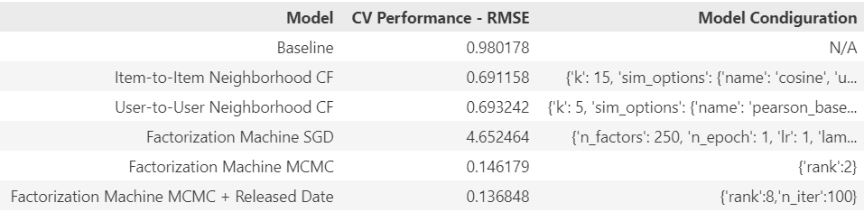
</p>

It's show up that **Context-Aware Factorization Machine** with **Monte Carlo Markov Chain (MCMC)** Optimization is indeed having better *RMSE* score in **0.1461** rather than **Stochastic Gradient Descent** with *4.652*. This model is also give less *RMSE* score compare to previous Neighborhood Collaborative Filtering. By adding more context like released date feature into model, it increase model performance by reducing *RMSE* into **0.1368**. However adding released date context, it increase factorization machine of degree into 8 hence require more computational cost.

Let's try this recommendation to get N-recommendation games on certain user IDs. Below is few games that has played by user **3924036**

<p align=center>
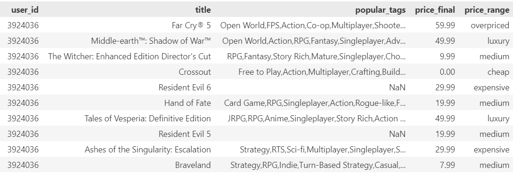
</p>

These are the recommendations for two price ranges based on User ID **3924036**'s preferences. The first 10<sup>th</sup> recommendations are for medium-priced games, while the last 10<sup>th</sup> recommendations are for expensive ones.  Our primary objective is to steer User ID 3924036 towards the medium-priced games to increase the likelihood of a purchase. However, it's worth noting that the recommendations for expensive games appear to align better with this user's historical gaming preferences.

The recommendations for expensive games seem to be more in line with the user's gaming history and their demonstrated ability to afford pricier titles. In this case, User ID **3924036** appears to have the financial capacity to invest in expensive or even luxury-priced games and displays a preference for free games over cheaper options. As a result, the recommendations in the expensive range appear to be more varied and serendipitous. Ultimately, our recommendation system takes into account both the user's historical preferences and their capability to purchase games. While our primary aim is to guide them towards medium-priced games, we also recognize the importance of presenting recommendations that align with their gaming history and financial capacity.

<p align=center>
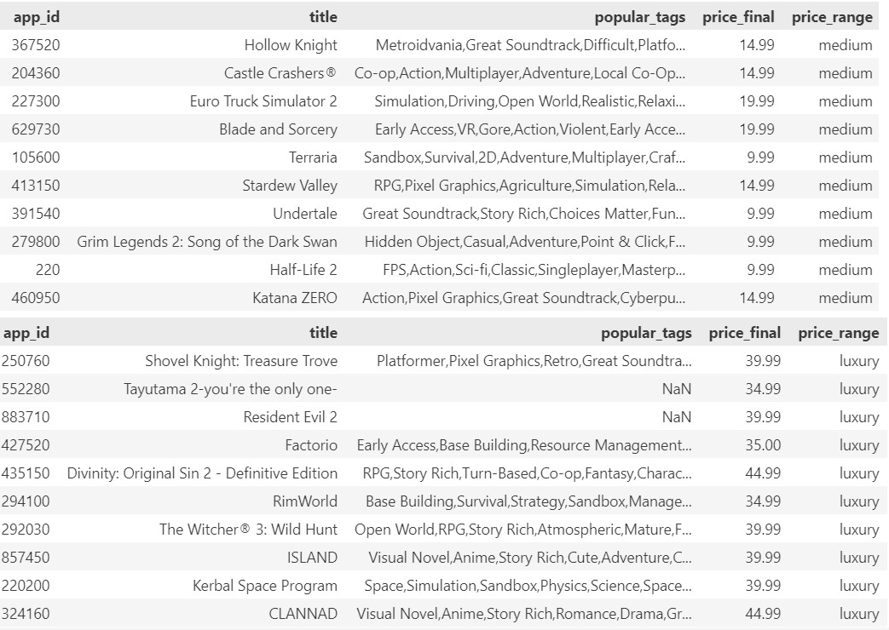
</p>

<p align="right">(<a href="#readme-top">back to top</a>)</p>

### FM: Classification Objective

Classification problem calculate probability that x is belong to class 1, so sigmoid function is used to approximate the probability of the function.

$$\sigma{(\hat{y}(x))} = p(x) = \frac{1}{1 + e^{-(\hat{y}(x))}} $$

The objective of classification task is to maximize the probability of a class.

$$Objective = \max_{w}[\prod^{N}_{i=1}P(y_{i}|X^{(i)},w)] $$

Multiplication function will cost computational time greatly, then we work on a logarithmic scale, because PDF term is additive.

$$Objective = \min_{w*,v*}[-\frac{1}{N}\sum_{iED}(y^{(i)}.log(p(x^{(i)})) + (1-y^{(i)}).(1-log(p(x^{(i)}))))] + [\frac{1}{2}\sum_{m}(w^2 + \lVert v_{m} \rVert^2)] $$

- $y_{i}$ = True Class
- $p(x^{(i)})$ = Probability that x belongs to class 1
- w* = weight from feature
- v* = latent factor for feature

<p align="right">(<a href="#readme-top">back to top</a>)</p>

### FM: Classification Models

In this section, dataset from Table 4 is used. FM model model takes sparse matrices of `scipy.sparse` as its feature input. [`DictVectorizer`](https://scikit-learn.org/stable/modules/generated/sklearn.feature_extraction.DictVectorizer.html) from `sklearn.feature_extraction` is applied to features (X) to transforms the categorical variables (user_id, app_id, price_rate) into a one-hot encoded vectors. Table 3 in our project will be used on this model.

```python
from sklearn.feature_extraction import DictVectorizer

v = DictVectorizer()

X_fm = X_train.to_dict(orient='records')
y_fm = np.asarray(y_train.values)

X_fm = v.fit_transform(X_fm)
```

[`FMClassification`](https://github.com/tohtsky/myFM) from `myFM` libraries is used to predict class probability of context-aware factorization machines. This model apply **Bayesian Factorization Machines** with **Gibbs sampling** or **Markov Chain Monte Carlo (MCMC)** algorithm to optimizing the parameter model rather than **Stochastic Gradient Descent**. parameter *rank (d)* is hyperparameter that is used in here to defined factorization machine of degree that will be used as the model.

```python
fm_classification = myFMClassification(rank=2)

fm_classification.fit(X_fm, y_fm)

y_pred_fm = fm_classification.predict(X_test)
```

<p align="right">(<a href="#readme-top">back to top</a>)</p>

### FM: Classification Models Performance

<p align=center>
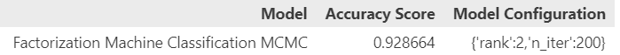
</p>

Accuracy score given by Classification model to predict whether certain User IDs would recommend or not a game IDs is 0.92. This score is in good range scale to consider in 1000_000 instances data prediction. However both rating prediction or class of user to recommend the game or not is defined by explicit data that commonly given by many users.

# Alternating Least Square
-----

Utilizing implicit data is tends to takes more in account to consider which user does higher preference, because we do not have scale of preference like explicit data. We just simply create mapping rule to encode play hours into binary value such as preference. By encoding user utility value into binary vaue does not solve which user are having more strong preference/confidence. We could add term confidence (c) which equal to 

$$ c_{ui} = 1 + \alpha{r_{ui}} $$

We want to predict class of user's preference, we could imply that user u preference over item i ($p_{ui}$) could be produced from interaction factor between user and item factor

$$ \hat{p_{ui}} = x_{u}.y^{T}_{i} $$

$c_{ui}$ = Confidence term from user u to item i<br>
$r_{ui}$ = utility value from user u to item i<br>
$\hat{p_{ui}}$ = predicted preference from user u to item i (Binary Values: 0/1)<br>
$x_{u}$ = user u factor<br>
$y_{i}$ = item i factor

The objective is minimize prediction error of preference from each user to each item in training data, but we might not know the difference between two user who has played the same game. we suspected that the more user spent to play the game, the stronger the confidence, hence we could add confidence term in our objective function.

$$Objective = min\sum_{u,i} c_{ui} (p_{ui} - \hat{p_{ui}})^2 $$

We can add Ridge Regularization (L2 Norm) to our user and item factor, our purpose to generate prediction on item that user might have not played yet, thus the weight should not be zero

$$Objective = min\sum_{u,i} c_{ui} (p_{ui} - \hat{p_{ui}})^2 + \lambda(\sum_{u}\lVert x_{u} \rVert^2 + \sum_{i}\lVert y_{i} \rVert^2) $$

Here our final objective form

$$ Objective = \min_{x*,y*}\sum_{u,i} c_{ui} (p_{ui} - x^{T}_{u}.y^{T}_{i})^2 + \lambda(\sum_{u}\lVert x_{u} \rVert^2 + \sum_{i}\lVert y_{i} \rVert^2) $$

Alternating least square is applied to optimize the objective form by updating each parameter while holding constant user factor when updating item factor and vice versa. The approach is similar to Gradient Descent by find partial derivative from objective function to our parameter

$\frac{\partial{Objective}}{\partial{\theta}} = 0 $ while our parameter $\theta = x_{u}$ or $y_{i}$.

Using the partial derivative function above to each factor, we can obtain update to user factor while holding item factor constant,

$$ x_{u} = (Y^T.C^u.Y + \lambda{I})^{-1} . (Y^T.C^u.p(u)) $$

and obtain the update to item factor while holding user factor constant,

$$ y_{i} = (X^T.C^i.X + \lambda{I})^{-1} . (X^T.C^i.p(i)) $$

<p align="right">(<a href="#readme-top">back to top</a>)</p>

### ALS Models

Alternating Least Square used in this project is using **`als`** from [**`implicit`**](https://github.com/benfred/implicit) libraries toward dataset of consist user IDs, app IDs, and hours user spent on playing certain games, turn into sparse coo matrix in aim to reduce computational cost since we have sparse matrix.

```python
def preprocess_implicit_data(data,feature):
    row = data.user_id.values
    col = data.app_id.values
    value = data[feature].values

    utility_matrix = sp.coo_matrix((value, (row, col)))

    return utility_matrix

>>> <19886x2948 sparse matrix of type '<class 'numpy.float64'>'
	with 20000 stored elements in COOrdinate format>

from implicit.evaluation import train_test_split

# split data into train and test
train_full,test = train_test_split(implicit_hour,train_percentage=0.8)

import optuna

# import model alternating least squares
from implicit import als
from implicit.evaluation import ndcg_at_k

def als_tuning(trial):
    factors = trial.suggest_int(name='factors',
                                             low=10,
                                             high=100,step=10)
    regularization = trial.suggest_float(name='regularization',
                                         low=0.0001,
                                         high=1.0,
                                         step= 0.001)

    alpha = trial.suggest_float(name='alpha',
                                      low=0.001,
                                      high=1.0,
                                      step= 0.001)

    # instanciate model
    model_als = als.AlternatingLeastSquares(factors=factors,
                                            regularization= regularization,
                                            alpha= alpha)

    # fit model
    model_als.fit(train)

    # test
    val_metrics = ndcg_at_k(model = model_als, train_user_items= train,
                                  test_user_items = val,K=5)
    return -val_metrics

# minimizing is equal to
study_als = optuna.create_study(direction="minimize")
study_als.optimize(als_tuning, n_trials=2)
```

<p align=center>
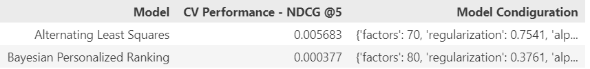
</p>

Previously we are already used Neighborhood, Factorization Machines to predict rating and return top-N recommendation games based on User IDs **3924036**, now we are using **Alternating Least Square** to return top-N of recommendation games based on User ID's activity log of Implicit data such as hours spent on few games.

<p align=center>
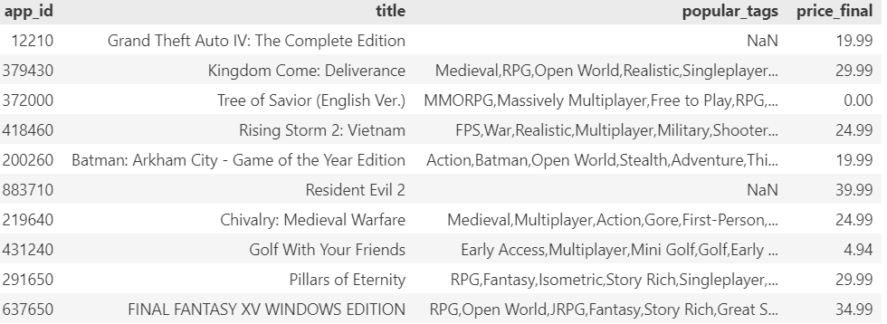
</p>

Recommendation given by models represents few well-known games and seemingly relatable to historical games played by the User IDs **3924036**. Since the evaluation score used on rating prediction in Factorization Machine and ordered ranking games recommendation by impliciy data, the comparation between both method is difficult to tell, but since the games played by User IDs is well known to, we can compare by recommendation return based on the games genre or popular tags.

<p align="right">(<a href="#readme-top">back to top</a>)</p>

# Conclusion
-----

- **Content-based recommendation system** which relies on **similarity** between the items, displays good suggestion. However, it often tends to recommend games with similar titles from the same game franchise. This type of recommendation is well-suited for users who have a preference for playing games within the same franchise. For example, if we are seeking recommendations for games similar to Assassin's Creed Odyssey, it frequently suggests another Assassin's Creed Games.

- **Content-based recommendation** enhanced by the **Novelty Score**, offers more variability into its game suggestions compared to previous similarity-based approaches. Similar recommendation tend to align with similar genres or popular tags, but novelty is calculated based on user interactions. The novelty-score-driven recommendation system offers a more effective and diverse user experience, but it's important to strike a balance between novelty and relevance, considering factors such as release date and user interaction counts.

- **Content-based recommendation** incorporating **Serependity**, offers more diverses game suggestions while maintaining relevance to the searched game's genre or popular tags. The serependity score is designed to introduce element of surprise and novelty into the recommendations, which can help users discover new gaming experiences. It takes into account various factors that may not be directly tied to the primary characteristics of the searched game. The benefit of this approach is that it can prevent the recommendation system from becoming too predictable and may lead users to discover unexpected yet enjoyable games. However, it's important to strike a balance, as excessive randomness may result in less relevant suggestions. 

- **K-Nearest Neighbors Baseline (KNNBaseline) algorithm** from the **Surprise** library, is applied to both user-to-user and item-to-item **Collaborative Filtering**, to predict user ratings for specific items.  In our evaluation, we observed that Collaborative Filtering, both **user-to-user and item-to-item, yielded an RMSE (Root Mean Square Error) of approximately 0.691 and 0.692**, respectively. While these RMSE values indicate relatively accurate predictions, they do not fully capitalize on the incorporation of additional contextual factors, such as game pricing or release dates, which was one of our primary objectives.

- Our objective is to recommend a games within medium price range to increase likelihood of user purchases. **Context-Aware Bayesian Factorization Machines** is applied to resolved this matter. In particular, the recommendation make use of categorical features, enhanchin interactions between users and items while optimizing through the **Monte Carlo Markov Chain (MCMC) algorithm**. This approaches is versatile to handle multiple categorical features, including genre, price range, and released date, even in high-dimensional settings, thanks to its factorization capabilities.

- Our evaluation, based on total **RMSE (Root Mean Square Error)**, demonstrates that **Context-Aware Bayesian Factorization Machines** consistently outperforms Neighborhood Collaborative Filtering in terms of accuracy.

- **Alternating Least Squares (ALS)** is a technique commonly used to leverage **implicit data**, such as the total hours users spend on a few games. However, ALS often yields a **lower Normalized Discounted Cumulative Gain (NDCG) score**, especially when dealing with datasets containing a large number of unique games. This occurs because ALS struggles to effectively model the vast diversity of games present.

<p align="right">(<a href="#readme-top">back to top</a>)</p>

# References

1. Bayer, Immanuel. "*fastfm: A library for factorization machines.*" arXiv preprint arXiv:1505.00641 (2015).
2. Kaminskas, Marius and Derek, Bridge. "*Diversity, Serendipity, Novelty, and Coverage: A Survey and Empirical Analysis of Beyond-Accuracy Objectives in Recommender Systems*." ACM Transactions on Interactive Intelligent Systems. Vol. 7. No. 1. Article. 2. ACM, 2016.
3. Hssina, Badr., Abdelakder, Grota., Mohammed, Erritali. "*Recommendation system using the k-nearest neighbors and singular value decomposition algorithms*." International Journal of Electrical and Computer Engineering (IJECE). Vol. 11. No. 6. IJECE, 2021.
4. Hu, Yifan., Yehuda, Koren., and Chris, Volinsky. "*Collaborative Filtering for Implicit Feedback Datasets*." 2008 IEEE International Conference on Data Mining (ICDM). IEEE, 2008.
5. Rendle, Steffen. "*Factorization machines*." 2010 IEEE International Conference on Data Mining. IEEE, 2010.
6. Rendle, Steffen. "*Scaling factorization machines to relational data*." Proceedings of the VLDB Endowment. Vol. 6. No. 5. VLDB Endowment, 2013.


